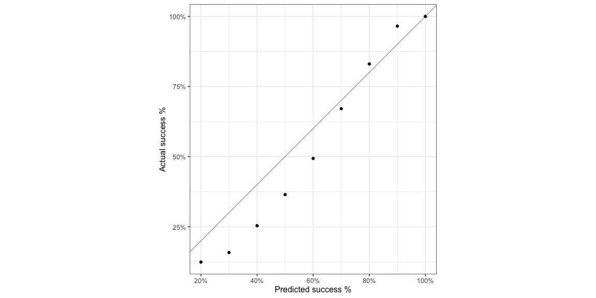
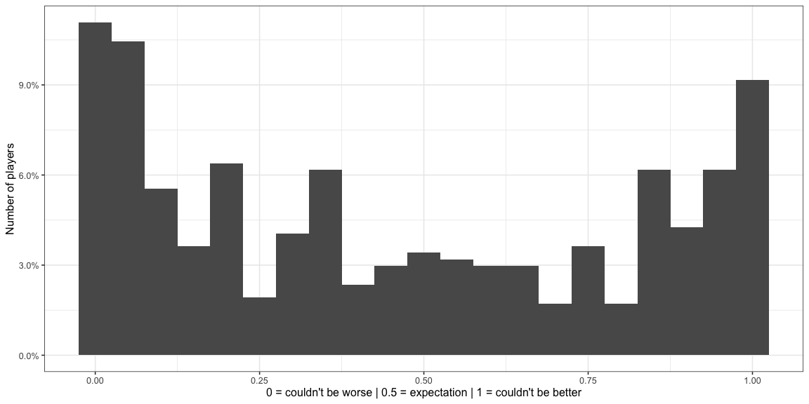
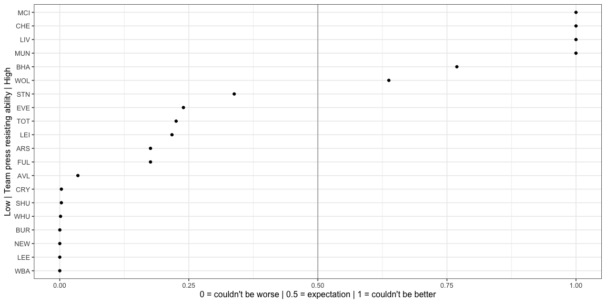
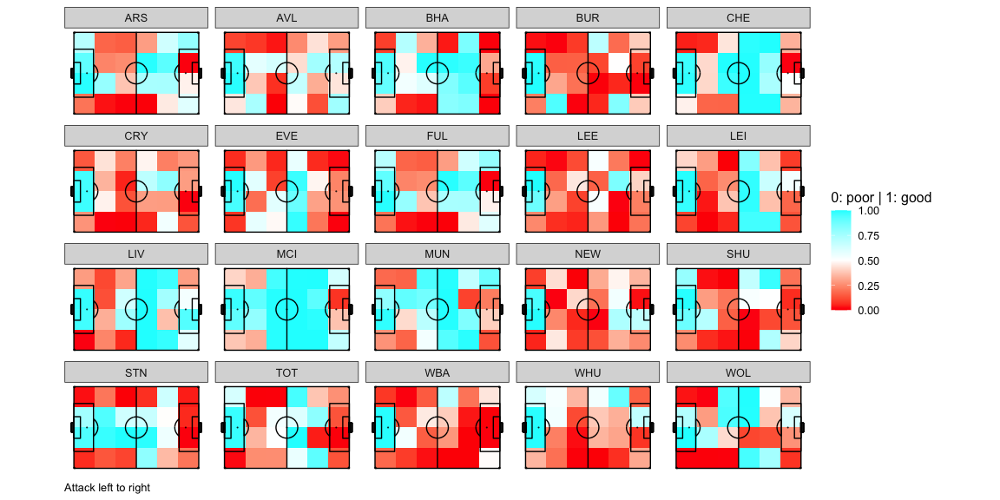
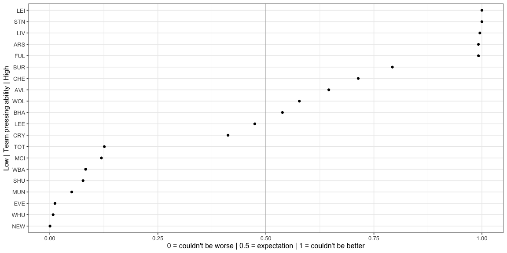
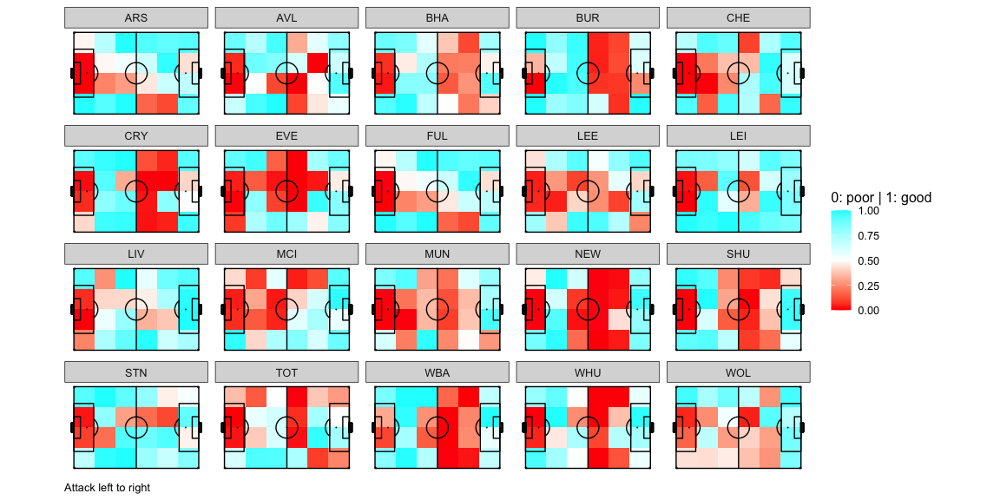

## Approach

TL;DR version - We build a model to predict how likely an average player
is to successfully perform the action of their choice. Think of it as
having an xWhateverTheyAreDoing model. Next we use it for the actions of
these players when they were under pressure. By comparing how often
specific players executed an action successfully compared to the model
estimated probabilities of them executing their actions successfully, we
can find out players that are good at escaping pressures, and so on.

Details:

The inputs to the model are various things like type of event ( pass,
dribble, etc., ) quantities related to pitch control in the
neighbourhood of the player, game state, position on the pitch, etc.

The data I have doesn’t have pressures specified explicitly. I proxy a
pressure as any situation where the player with the ball had less than
0.5 pitch control probability in their neighbourhood.

Players who exceed the expected success rate are press resistant
players. The ranking is done on the basis of how likely it was for a
player to achieve a particular success rate given the estimated
probabilities - the lesser the likelihood with a success rate in excess
of the estimated probability, the higher the ranking.

It’s likely that the squad selection, strategy, etc. is different to
counter the way the opposition plays, so if the opposition employs a
press maybe the team selects a different line up and plays differently
to escape the press, whereas against oppositions that don’t employ a
press maybe the line up is different. Some of the features capture some
of these patterns but it’s hard to capture everything thoroughly.

Since the model needs to reflect the probabilities for an average
player, the model calibration needs a balanced dataset. The way I did it
was by taking 5 events each against 5 different oppositions for each
player, which eliminates about 120 players of the total of about 500
players who don’t meet this condition. The resulting dataset has 25
events for each player, 5 each across different oppositions. The model
is an ensemble so repeated samples of this match-action are created from
the parent dataset to feed to each model. This is not perfect, referring
back to some of the factors mentioned in the previous paragraph, but is
the best I could think of.

At the time of prediction, we use only the part of the ensemble which
hasn’t used the data being predicted on for training. To ensure that
there is never a case where some data has been used in every model in
the ensemble, we actually have a stronger cut-off than the 5 matches - 5
events one described above to filter down the data before drawing a
sample for training. This brings the number of players down to about
330.

Pressures and escaping pressures also involves the rest of the team and
that is something that I’m unable to differentiate yet with this model.
For example, the model says many Man City players are good at getting
out of a pressure situation but is that because the players are all very
talented or does the team play in a way that makes it easy for a player
on the team to get out of a pressure situation? My feeble attempt to
address this was to build four models in which I included all the other
n - 2 features and included or excluded information about which team the
player played for and which opposition the player was playing against.
The results don’t change drastically between the four models so I base
my inferences only on the model with the team and opposition included.
I’d probably use the model just as a guide to mark players that seem
press resistant or not and not fret too much about the rankings. That
said, the rest of the post does have rankings since that’s the easiest
validation of this model.

## Data source

The data was provided by SkillCorner, event data and broadcast tracking
data for the EPL 20-21 season, through the Friends of Tracking research
group.

## Results

Looking at players which had at least 30 events -

A comparison of the success rate vs. success probabilities indicates the
model is capturing something useful. There is scope for improvement but
it might be good enough to start with given there isn’t anything else as
far as I know.

The distribution of all the players ability to escape the press is as
below with the highest ability players highlighted in the next chart.
Would have expected this to be flatter or more concentrated in the
middle though.

The ability of teams to escape the press is as below -

… and where they tend to be more successful escaping pressure -

The ability of teams to successfully press their opposition is as below
-

… and where they tend to be more successful with their pressures -

## 
